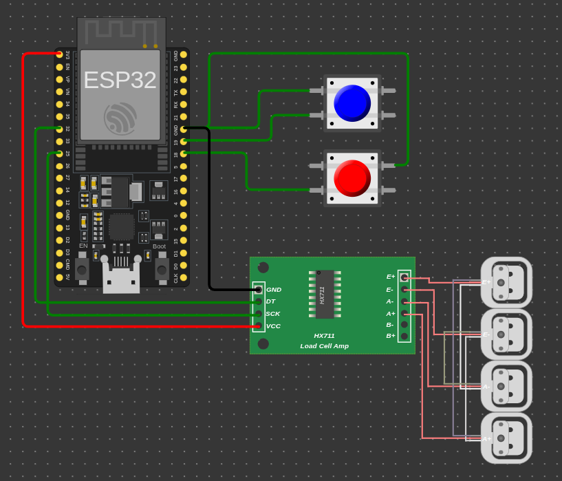
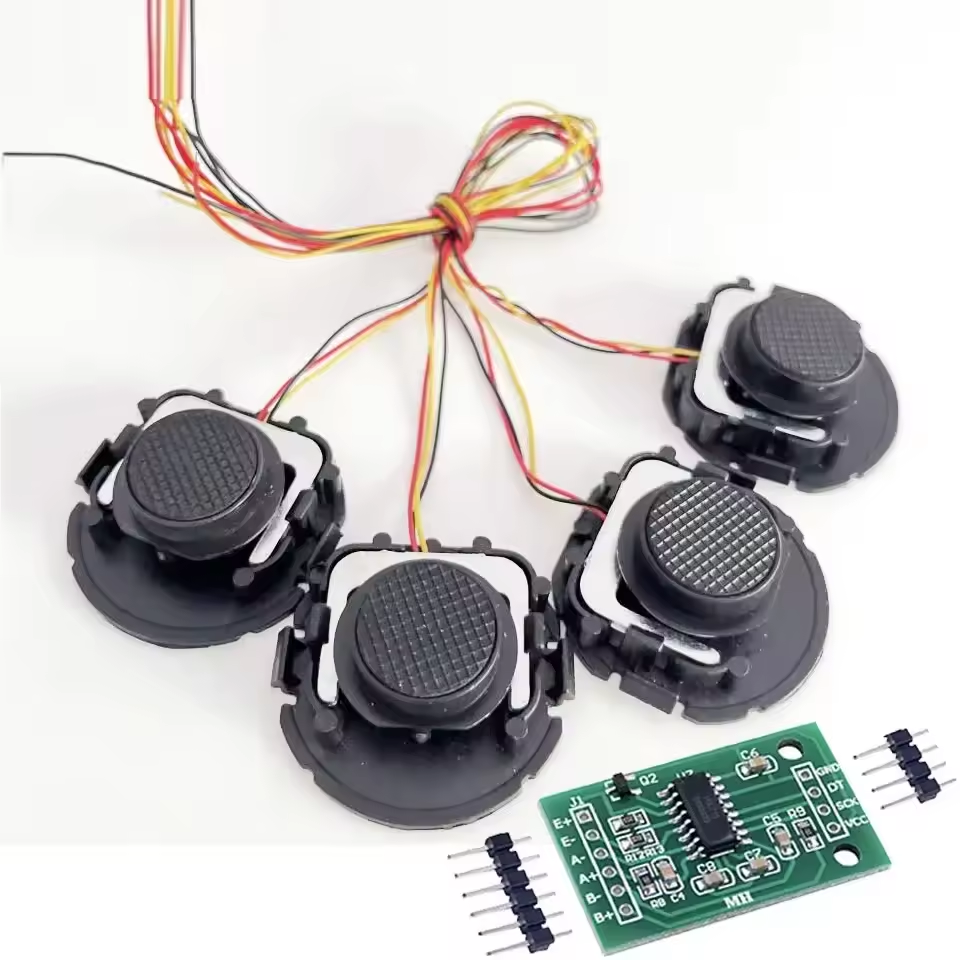
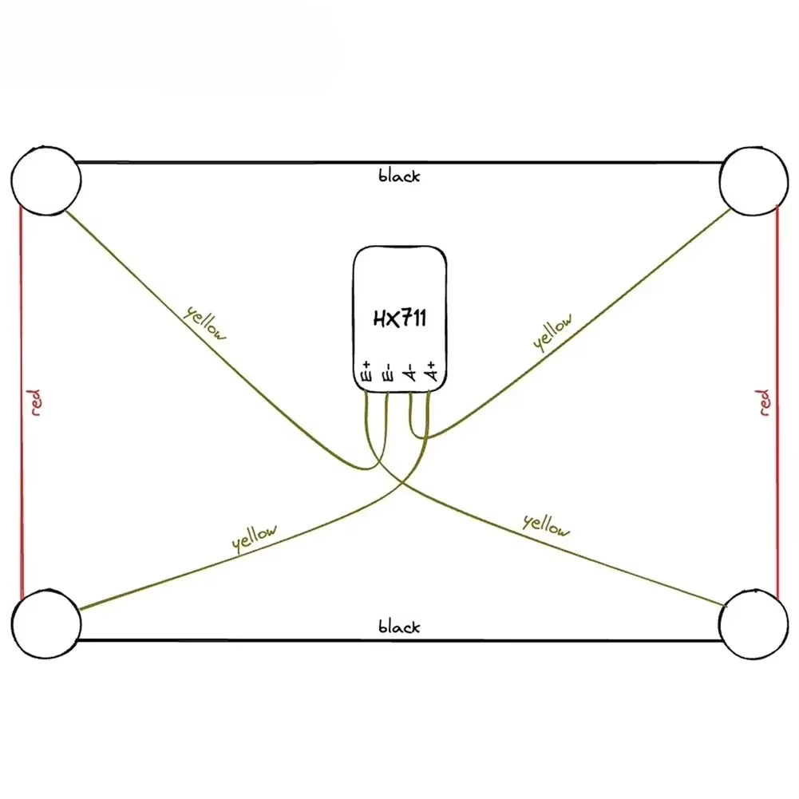

# FilamentSense

FilamentSense — проєкт для ESP32 (Arduino + PlatformIO), який контролює вагу філаменту на 3D-принтері.

Схема на поточному етапі:
- 4 тензодатчики формують платформу;
- сигнал зводиться в один міст (через правильне wiring/combinator);
- міст читається одним HX711;
- ESP32 читає вагу, зберігає baseline, надсилає статус/алерти в Telegram.

## 1. Що реалізовано

- читання ваги з HX711;
- консольне калібрування HX711 (`calib ...`);
- збереження `baselineWeight` у flash по кнопці #1;
- збереження timestamp запису baseline у flash;
- підключення до Wi-Fi на старті;
- спроба NTP синхронізації часу на старті;
- ручний Telegram-звіт по кнопці #2;
- автоматичні Telegram-алерти по порогах залишку філаменту 500 г і 100 г;
- антидублювання алертів (без спаму);
- offline-режим для симуляції без реальної мережі.

## 2. Потрібні компоненти

- ESP32 (`esp32dev`)
- 4 тензодатчики
- 1 модуль HX711
- 2 кнопки
- USB-кабель
- Python + venv + PlatformIO

## 3. Конфіги

### 3.1 Hardware config

Файл: `include/config/HardwareConfig.h`

Ключові параметри:
- `kScaleHx711` — піни HX711 `DOUT/SCK`
- `kHx711RawUnitsPerGram` — коефіцієнт калібрування
- `kFilamentSpoolWeightGrams` — вага котушки (за замовчуванням `3000` г)
- `kFilamentWarningThresholdGrams` — warning-поріг (`500` г)
- `kFilamentCriticalThresholdGrams` — critical-поріг (`100` г)
- `kButtonPins` — піни двох кнопок

### 3.2 Wi-Fi + Telegram + Offline config

Створіть `include/config/WifiConfig.h` як копію з `include/config/WifiConfig.h.example` і заповніть:
- `kWifiSsid`
- `kWifiPassword`
- `kTelegramBotToken`
- `kTelegramChatId`
- `kNtpPrimary`, `kNtpSecondary` (можна лишити дефолт)
- `FILAMENTSENSE_OFFLINE_MODE`
- `LED_PIN`

`FILAMENTSENSE_OFFLINE_MODE`:
- `0` -> реальне підключення до Wi-Fi + реальні HTTP запити в Telegram
- `1` -> мережа повністю вимкнена для симуляції (Wi-Fi/NTP/HTTP не виконуються), звіти/алерти друкуються в Serial

## 4. Підключення

### 4.1 HX711 -> ESP32

Для `kScaleHx711 = {4, 3}`:
- `HX711 DT` -> `GPIO4`
- `HX711 SCK` -> `GPIO3`
- `HX711 GND` -> `GND`
- `HX711 VCC` -> `3V3` (рекомендовано)

Примітка: `DT` на модулі = `DOUT` у коді.

### 4.2 Кнопки -> ESP32

У коді `INPUT_PULLUP`, отже кнопка має замикати пін на `GND`.

- Кнопка #1: `Baseline Save` (рекомендовано позначити червоним) -> `GPIO18`
- Кнопка #2: `Status / Telegram Report` -> `GPIO19`

## 5. Логіка вимірювань

- вимірювання виконується **раз на хвилину**;
- перший вимір робиться **одразу після старту**;
- постійного спаму у Serial немає.

## 6. Логіка кнопок

### 6.1 Baseline Save (GPIO18)

При натисканні:
1. Береться остання валідна вага як `baselineWeight`.
2. `baselineWeight` зберігається у flash.
3. Записується timestamp baseline (якщо час валідний після NTP).
4. Скидається цикл алертів 500/100 г для нового baseline.

Логи:
- `baselineWeight saved=... g`
- або `baselineWeight save failed: ...`

### 6.2 Status / Telegram Report (GPIO19)

При натисканні:
- формується звіт;
- цей самий текст друкується в Serial;
- цей самий текст надсилається в Telegram (або тільки в Serial у offline mode).

Формат звіту:
1. `🔴 ФІЛАМЕНТУ ЗАЛИШИЛОСЬ: ... г`
2. `Початкова вага брутто: ...` + дата запису baseline
3. `Пройшло: ...`
4. `Поточна вага брутто: ...`

## 7. Автоалерти 500 г / 100 г

Залишок рахується так:
- `abs(baselineWeight - currentGrossWeight - kFilamentSpoolWeightGrams)`

Поведінка:
- при досягненні `<= 500 г` надсилається алерт;
- при досягненні `<= 100 г` надсилається повторний алерт;
- текст алерту:
  - `⚠️ Увага! Закінчується філамент.`
  - з нового рядка повний статус (як у ручному звіті).

Антиспам:
- кожен поріг позначається як "надісланий" після успіху;
- повторів по тому ж порогу більше немає;
- якщо відправка неуспішна, буде retry на наступному циклі вимірювання (раз на хвилину);
- після нового `baselineWeight` прапори порогів скидаються.

## 8. Калібрування

Serial-команди:
- `help`
- `calib tare`
- `calib known <grams>`
- `calib show`

## 9. Розгортання

```bash
python3 -m venv .venv
.venv/bin/pip install --upgrade pip
.venv/bin/pip install platformio
.venv/bin/pio run
.venv/bin/pio run -t upload
.venv/bin/pio device monitor -b 115200
```

## 10. Архітектура

- `src/hal/*` — апаратний доступ
- `src/domain/*` — бізнес-логіка
- `src/app/*` — orchestration
- `src/storage/*` — flash persistence




